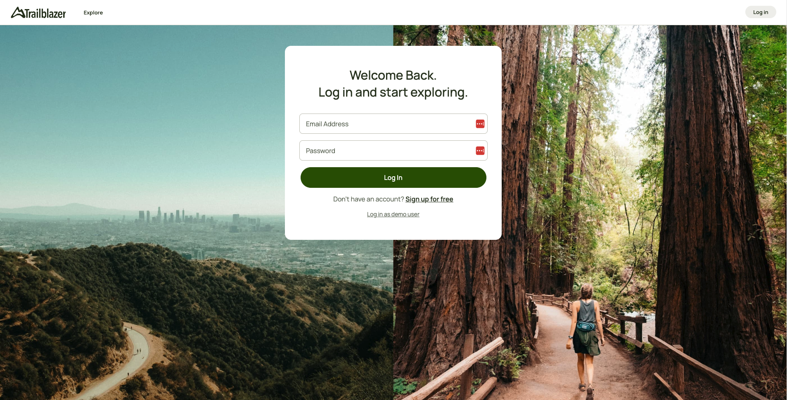
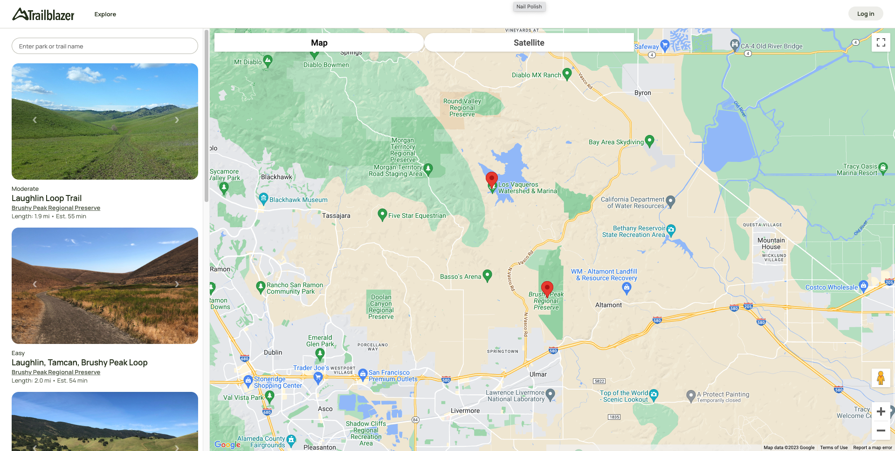
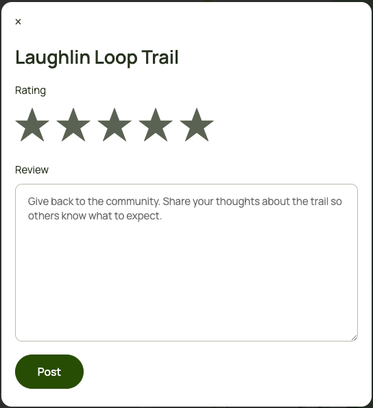

<h1>Trailblazer</h1>
</img>
<h3>Background</h3>

This is a full stack clone of AllTrails. It allows you to view, reviews, like, and comment on hiking trails and nature parks.
<a href="https://mysite-fnk5.onrender.com/">Click here to view!</a>

<h3>Technologies</h3>

- React
- AWS
- Rails
- BCrypt
- PostgreSQL

<h3>Features</h3>

- User Auth
  - Users can log in and log out securely

- Parks & Trails
  - Users can view trails index, trails show page, and parks show page
 </img>

- Reviews
  - Users can post, edit, and delete reviews on trails
  - Reviews consist of a star rating and a comment
  </img>

- Map
  - Trail and Park locations will display on map

- Search
  - Users can search for a specific trail or park

<h3>Future Implementation</h3>

- User Profile
  - Users can view, edit, and delete their profiles
  
- Bookmarks
  - Users can bookmark trails to save them to their profiles
